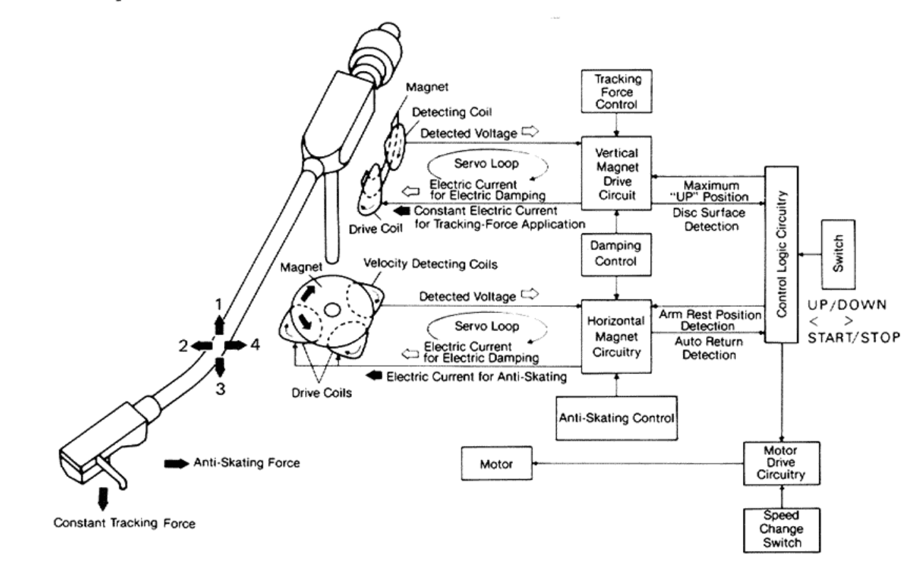
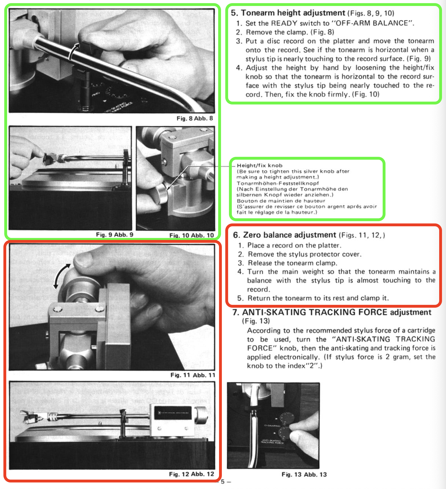
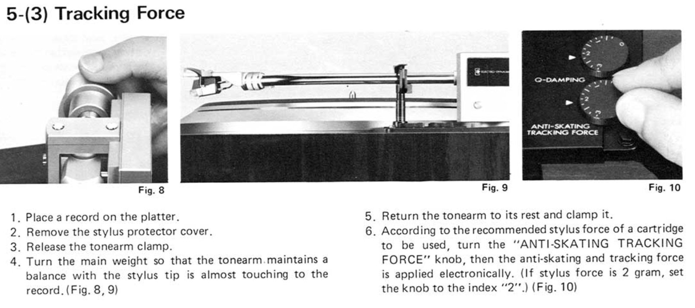

# JVC-QL-Y5
JVC QL-Y5 repository containing instructions on various maintenance procedures

# General technical information
- Headshell model: JVC PH-8
- Victor JVC Original stylus & cartridge:
  - Stylus: DT-Z1EB (JVC/Nivico DT-Z1 series)
  - Cartridge: MD-1025EB (JVC/Nivico MD-1025)
- Microcontroller IC: UPD 554C-033
  - μCOM-45 4-bit family
  - integrated masked ROM
    - A picture of the die would be great to dump the original firmware from the internal ROM
  - UPD 554C family
- Motor control IC:
  - VC4046 - PLL Phase Locked Loop
- Test record
  - JVC Electro-Dynamic Servo Tone Arm
  - Model JVC 2DY-8"

# Sintetic description of all the regulations relative to the tonearm

- **ANTI-SKATING TRACKING FORCE KNOB**: cancels centripetal/centrifugal force AND sets the cartridge/stylus traking force
  - place the tonearm on a CD disk on the turntable while it rotates and turn the anti-skating knob till the tonearm stays steady in the same position on the CD disk
  - turn the "ANTI-SKATING TRACKING FORCE" knob, then the anti-skating and tracking force is applied electronically. (If stylus force is 2 gram, set the knob to the index"2".)
  - This knob is provided to cancell the centripetal force (sliding of the tonearm to the center of the record) and to prevent the stylus tip from sliding or exerting unwanted force to the inner side of the record groove.
These are automatically and electrically set to the optimum value by selecting the designated stylus force.
- **Q-DAMPING KNOB**: damps tonearm resonance vibrations
  - Turn the Q-DAMPING knob to equal the stylus force. (If stylus force is 2 gram, set the knob to the index of "2".)
  - This knob is provided to smoothen stylus tracing horizontally and vertically along with the record disc grooves and to effectively lower the resonance peak levels of the tonearm.
  - When Q-DAMPING is in opera-tion:
    - Trackability and sound quality are improved,
    - Resistance against howling is much increased,
    - S/N ratio and wow-and-flutter are improved, etc.
- **TONEARM ZERO BALANCE ADJUSTMENT**: tonearm parallel (balanced, no tilts) to the record surface with *electronic control ON*
  - Tonearm ON the platter surface
  - sometimes referred as "tracking force" too in the service manual
    - that could be because if the tonearm not parallel to the platter surface, more or less that the traking force set on the "ANTI-SKATING TRACKING FORCE" knob might be applied
  - neutral position of the tonearm when *electronic control is aplied*
  - rotate the counterweight till the tonearm stays parallel to the platter surface with *electronic control ON*
- **TONEARM HEIGHT ADJUSTMENT**: distance between the tonearm and the platter with the tonearm parallel to the record surface with *electronic control OFF*
  - Tonearm OFF the platter surface, on the tonearm rest stick
  - Adjust the height by hand by loosening the height/fix knob so that the tonearm is horizontal to the record surface with the stylus tip being nearly touched to the record. Then, fix the knob firmly.
  - It's usually ok, leave it as is
- **TONEARM OFF-SET POSITION**: tonearm rest position on the tonearm rest stick
  - should be regulated from internal potentiometers (VR801)
  - It's usually ok, leave it as is
- **CUEING (UP/DOWN) HEIGHT**: distance between the platter and the stylus when the up button has been pressed to lift the tonearm
  - stylus tip clearance increase/decrease when moving the tonearm on the disk surface without reproducing the record
  - do it after completition of tonearm height regulation with electronic control set to on
  - appropriate clarence from the record should be 6mm
  - It's usually ok, leave it as is
- **LEAD IN**: offset on the record after which the tonearm goes back to rest
  - record end position
  - It's usually ok, leave it as is
- **LEAD OUT**: offset on the record where the tonearm starts the reproduction
  - record start position
  - It's usually ok, leave it as is

## Confusing stuff
 \

Can't understand the difference between **TONEARM ZERO BALANCE ADJUSTMENT** and **TONEARM HEIGHT ADJUSTMENT**. I can't make sense of these two regulations.

I think the tonearm should stay parallel to the platter when *OFF-ARM BALANCE* if off and that traking force should be applied only when *OFF-ARM BALANCE* is on...

READY switch
  - *ON*: Depress this switch to power the turntable system on. SPEED and SIZE indicators light. Stylus force, anti-skating and Q-damping are automatically applied, as already set.
  - *OFF-ARM BALANCE*: Re-depress the switch to cut the power off. The SPEED, SIZE and QUARTZ LOCK indicators go out, and the stylus force, anti-skating and Q-damping become "zero"
  - *Note*: When you re-depress the READY switch, make sure the tonearm is clamped on the arm rest, otherwise you may damage a record or the stylus. Even when the READY switch is set to OFF, about 1 watt power is consumed. Accordingly, disconnect the power cord from wall outlet to cut the power completely off.
    - Why a record can be damaged, because the platter sping if moving the tonearm to it even with OFF-ARM BALANCE off?

For some reason it seems that putting Q-damping to 0 should allow manual operation of the turntable that should not lift the tonearm anymore when reaching the record end...
